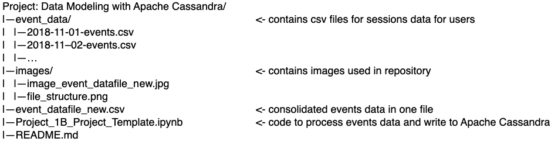

# Project Description: Data Modeling with Apache Cassandra

In this project, we are creating an ETL pipeline for a startup, Sparkify, that reads data from a directory of csv files and loads the data into an Apache Cassandra to understand which songs the users are listening. The data is processed from the raw events csv file, consolidated in one file, loaded into Apache Cassandra and tested with a few queries to ensure that it was properly loaded.

## There are three tables that have been created in this database:

1. song_sessions - table that contains information about sessions and songs
2. user_sessions - table that contains information about user sessions and the song in that session
3. user_song_history - table that contains information about the songs that a user has listened to

## ETL Process:

1. The files in event_data directory are processed into one csv data file: event_datafile_new.csv
2. The Apache Cassandra keyspace song_data is created and the three tables listed above are created and loaded with data from the event_datafile_new.csv
3. Queries are used to check that the data was inserted.
4. The tables are dropped and the database connection is closed

## Project Structure:

    

## How to Run the Project: 

In order to execute the code in this workspace, please open the terminal from the home diretory and run 'jupyter notebook' then select Project_1B_Project_Template.ipynb and run through the cells. You can also navigate to https://github.com/sagrawal01/udacitydataengineering and go to Project: Data Modeling with Apache Cassandra directory to execute the code. Please clone the repository and set up a virtual environment or docker container to execute the code within your local machine. You can use cassandra:latest public docker container and install python and jupyter notebook as well as cassandra-driver to run this code.
