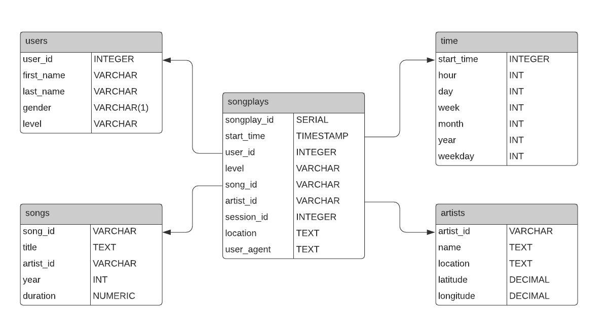

# Project Description: Data Modeling with Postgres

In this project, the goal is to implement a star schema based database for analyzing Sparkify's data on songs and user activity.

## There are five tables that have been created in this database.

1. songplays - facts table that contains information about the played songs.
2. songs - dimensions table that contains the list of songs
3. users - dimensions table that contians the list of users
4. artists - dimensions table that contains the artist information
5. time - dimensions table that contains the timestamp broken down to an hourly level

The data model is a star schema and the structures of the tables is as follows:

    

## There are five main files: 

1. create_tables.py is used to create and connect to the Sparkify database, as well as create and drop tables detailed in sql_queries.py.
2. sql_queries.py contains statements to create the five main tables in the database, drop the tables and select songs and artists based on song title, artist name and song duration (used to insert records into the songplays table). 
3. etl.py is used to do the following: 
    1. Process the list of songs in the data/song_data directory and insert the data into the songs and artists tables (process_song_files function). 
    2. Process the log files of user activity in the data/log_files directory and insert the data into the time, users and songplays tables (process_log_files function).
    3. Both steps 1 and 2 call the process_data function which iterates through each file in a given directory and processes it.
4. etl.ipynb is utilized to test and write functions that are in the etl.py file.
5. test.ipynb is utilized to validate that the tables were created and data has been inserted into those tables.
    
## There are five tables that have been created in this database.

1. songplays - facts table that contains information about the played songs.
2. songs - dimensions table that contains the list of songs
3. users - dimensions table that contians the list of users
4. artists - dimensions table that contains the artist information
5. time - dimensions table that contains the timestamp broken down to an hourly level

The data model is a star schema and the structures of the tables is as follows:

**Songplays**

| Column        | Data Type       
| ------------- |:-------------:|
| songplay_id   | SERIAL        |
| start_time    | timestamp     | 
| user_id       | int           |  
| level         | varchar       |
| song_id       | varchar       | 
| artist_id     | varchar       |  
| session_id    | int           |
| location      | text          | 
| user_agent    | text          |  

**Users**

| Column        | Data Type       
| ------------- |:-------------:|
| user_id       | int           | 
| first_name    | VARCHAR       | 
| last_name     | int           |  
| gender        | varchar(1)    |
| level         | varchar       |
 
**Songs**

| Column        | Data Type       
| ------------- |:-------------:|
| song_id       | varchar       | 
| title         | text          | 
| artist_id     | varchar       | 
| year          | int           |
| duration      | numeric       |

**Artists**

| Column        | Data Type       
| ------------- |:-------------:|
| artist_id     | varchar       |  
| name          | text          | 
| location      | text          | 
| latitude      | decimal       |
| longitude     | decimal       |

**Time**

| Column        | Data Type       
| ------------- |:-------------:|
| start_time    | timestamp     | 
| hour          | int           | 
| day           | int           | 
| week          | int           |
| month         | int           |
| year          | int           |
| weekday       | int           |

